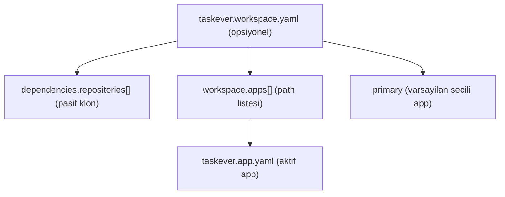
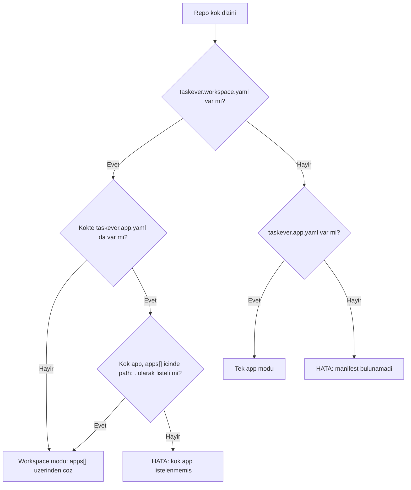
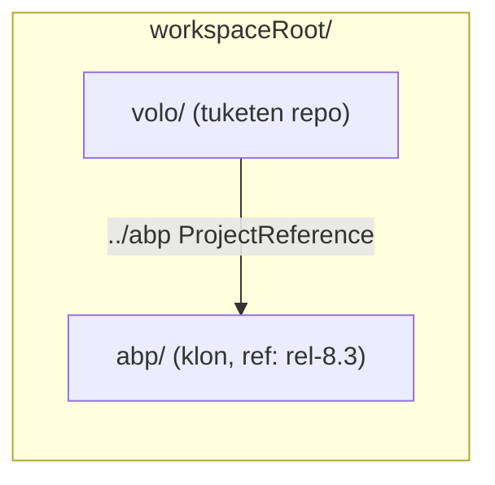

# RFC: taskever Workspace & App Manifestleri

Status: Draft
Scope: `taskever` sandbox/preview manifest formatı

## 1. Problem

Bugün sistem her repository kökünde **tek bir `taskever.yaml`** bekliyor ve bir repo = bir preview ortamı varsayıyor. İki gerçek ihtiyaç bu varsayımı kırıyor:

1. **Repo içinde birden çok app (monorepo).** Farklı klasörlerdeki uygulamaların çalışma mantığı birbirinden tamamen bağımsız olabilir; her biri kendi içinde container bağımlılıkları ve birden çok servis taşıyabilir.
2. **Repo'lar arası yerel referans.** Bir repo, başka bir repo'yu **relative yerel proje referansı** ile kullanabilir. Örnek: `volo` (private) repo'sundaki projeler ancak `abp` (public) repo'su diske **kardeş klasör** olarak klonlandığında derlenebilir (`.csproj` içindeki `../abp/...` referansları).

## 2. Tasarım ilkeleri

- Mevcut manifestin "ruhu" korunur: declarative, `init` -> `services` -> `completion`, `${preview.url(...)}` / `${service.internalUrl(...)}` templating, `primary` servis, `restartPolicy`/`watchPaths`.
- İki ihtiyaç **iki ayrı kavram** olarak modellenir (birleşik tek graf değil), çünkü yaşam döngüleri farklıdır:
  - Dış repo bağımlılığı **pasiftir** (sadece diske klonlanır).
  - App **aktiftir** (çalışır, port/health/preview taşır).
- **Aynı anda tek app** preview edilir. Başka app'i denemek isteyen kullanıcı aynı branch'te ayrı bir agent oturumu açar (platform katmanı; manifest dışı).
- **Geriye dönük uyumluluk yok.** `taskever.yaml` adı tamamen kalkar; legacy/eski kod yolu tutulmaz.

## 3. Kavram modeli



Üç katman:

- **Repository** — bir `git clone` birimi (abp, volo).
- **Workspace** — derleme için belirli bir klasör düzeniyle bir araya gelmiş bir veya birden çok repository'nin kök dizini. Dış repo bağımlılıkları ve app listesi burada tanımlanır.
- **App** — bir repository içinde bağımsız çalıştırılabilir/preview edilebilir birim.

## 4. İki dosya modeli

### 4.1 `taskever.app.yaml` (app manifesti)

Tek bir app'i tanımlar. Bugünkü `init`/`services`/`completion` şemasının aynısı, ek olarak **zorunlu `name`**.

```yaml
name: web                     # ZORUNLU; secim ve ${preview.url} adresleme kimligi

init:
  - dotnet restore MyApp/MyApp.csproj
  - dotnet build MyApp/MyApp.csproj -v q --nologo

services:
  - name: app
    kind: command
    cwd: MyApp
    command: dotnet run --no-build --no-launch-profile
    port: 8080
    primary: true
    healthcheck:
      path: /health-status
      expectStatus: "2xx"
      timeoutSeconds: 300
      intervalMs: 2000
    restartPolicy: on-change
    watchPaths:
      - MyApp/**/*.cs
    env:
      ASPNETCORE_URLS: http://0.0.0.0:8080

completion:
  pauseOn: manual
  idleTimeoutMinutes: 30
```

### 4.2 `taskever.workspace.yaml` (workspace manifesti)

Dış repo bağımlılıklarını ve app listesini tanımlar. App tanımı içermez; sadece app klasörlerine işaret eder.

```yaml
# Pasif: derleme icin diske klonlanacak dis repolar (kardes klasor layout)
dependencies:
  repositories:
    - url: https://github.com/abpframework/abp
      path: ../abp           # repo kokune gore relative -> sibling
      ref: rel-8.3           # ZORUNLU (branch/tag/commit) -> reproducible

# Aktif: previewable app'ler. Sadece path listeler.
workspace:
  primary: web               # varsayilan secili app (app name'e referans)
  apps:
    - path: apps/api         # icinde taskever.app.yaml barindirir
    - path: apps/web
```

## 5. Root çözümleme kuralları

Bir repository klonlandığında kök dizinde aşağıdaki çözümleme uygulanır:

1. Kökte **`taskever.workspace.yaml` veya `taskever.app.yaml`** bulunmalıdır. **İkisi de yoksa -> hata.**
2. Tek app + dış bağımlılık yoksa: kökte sadece `taskever.app.yaml` yeterlidir (workspace dosyası gereksizdir).
3. Kökte **her ikisi de** varsa: **workspace geçerlidir.** Bu durumda kökteki `taskever.app.yaml`, workspace `apps[]` içinde `path: .` olarak **listelenmek zorundadır**; listelenmemişse **hata**.
4. `workspace.apps[].path`, içinde bir `taskever.app.yaml` barındıran klasörü işaret eder (kök için `path: .`).
5. `workspace.primary`, `apps[]` içindeki bir app'in `name`'ine işaret etmelidir.



## 6. Layout sözleşmesi (dış repo bağımlılıkları)

- `dependencies.repositories` **yalnızca workspace seviyesinde** tanımlanır (app seviyesinde değil). Tüm repo'yu derlemek için ortak bağımlılıklardır.
- `path`, **repository kökü** baz alınarak çözülür. Sandbox bir workspace root açar:
  - tüketen repo -> `<workspaceRoot>/<repo>`
  - bağımlılık -> `path` ile belirtilen relative konum (`../abp` -> `<workspaceRoot>/abp`)
- Bu sayede `.csproj` içindeki `../abp/...` relative `ProjectReference` sandbox'ta **birebir** çözülür. Sandbox = developer'ın local makinesi.
- `ref` **zorunludur** (branch/tag/commit). Reproducible derleme için pin gerekir; drift'e izin verilmez.
- Dış repo için **sadece klonlama** yapılır; ayrı bir `init` adımı yoktur. Tüketen app'in build'i, referans verilen projeleri transitively derler.



## 7. Provisioning sırası

1. Tüketen repo klonlanır.
2. `taskever.workspace.yaml` varsa `dependencies.repositories[]` klonlanır (shallow + ref pin + cache önerilir) ve layout sözleşmesine göre yerleştirilir.
3. Seçilen app belirlenir (varsayılan `workspace.primary`; tek app modunda tek app).
4. Seçilen app'in `init` adımları çalışır.
5. Seçilen app'in `services` ayağa kaldırılır; `healthcheck` ile hazır kabul edilir.
6. `completion` kurallarına göre yaşam döngüsü yönetilir.

## 8. Doğrulama ve hata senaryoları

Manifest yükleyici aşağıdaki durumlarda fail-fast davranmalıdır:

- Kökte ne `taskever.workspace.yaml` ne `taskever.app.yaml` yok.
- Kökte workspace + app birlikte var ama kök app `apps[]` içinde `path: .` ile listelenmemiş.
- `workspace.primary`, mevcut bir app `name`'ine işaret etmiyor.
- İki app aynı `name`'e sahip (name'ler unique olmalı).
- `apps[].path` mevcut değil veya içinde geçerli `taskever.app.yaml` yok.
- `dependencies.repositories[].ref` boş/eksik.
- İki `dependencies` girişi çakışan `path`'e yerleşiyor.
- Dış repo klonu başarısız (auth, erişim, geçersiz ref) -> provisioning loglarında net mesaj.

## 9. Güvenlik ve performans notları

- **Auth:** private dış repo için token platform tarafından enjekte edilir; manifestte secret tutulmaz.
- **Cache/performans:** dış repolar için shallow clone + ref pin + paylaşımlı klon cache (abp gibi büyük repolarda her preview'da tam klon pahalıdır). Gerekirse sparse checkout.

## 10. Migration

- Mevcut `taskever.yaml` -> `taskever.app.yaml` olarak yeniden adlandırılır ve `name` alanı eklenir.
- Compat shim yoktur; `taskever.yaml` adı artık tanınmaz.

Bu repodaki örnek için sonuç ([taskever.app.yaml](../../taskever.app.yaml)):

```yaml
# taskever.app.yaml
name: app

init:
  - dotnet restore AbpTempSimpleApp/AbpTempSimpleApp.csproj
  - dotnet build AbpTempSimpleApp/AbpTempSimpleApp.csproj -v q --nologo
  - run: npm install
    cwd: AbpTempSimpleApp
  - run: abp install-libs
    cwd: AbpTempSimpleApp
  - run: dotnet run --migrate-database --no-launch-profile --no-build
    cwd: AbpTempSimpleApp
    env:
      ConnectionStrings__Default: Data Source=AbpTempSimpleApp.db
      App__SelfUrl: ${preview.url(app)}
      App__UseForwardedHeaders: "true"
      AuthServer__Authority: ${preview.url(app)}
      ASPNETCORE_URLS: http://0.0.0.0:8080
      ASPNETCORE_ENVIRONMENT: Development

services:
  - name: app
    kind: command
    cwd: AbpTempSimpleApp
    command: dotnet run --no-build --no-launch-profile
    port: 8080
    primary: true
    healthcheck:
      path: /health-status
      expectStatus: "2xx"
      timeoutSeconds: 300
      intervalMs: 2000
    restartPolicy: on-change
    watchPaths:
      - AbpTempSimpleApp/**/*.cs
      - AbpTempSimpleApp/Pages/**/*
      - AbpTempSimpleApp/wwwroot/**/*
    env:
      ConnectionStrings__Default: Data Source=AbpTempSimpleApp.db
      App__SelfUrl: ${preview.url(app)}
      App__HealthCheckUrl: ${service.internalUrl(app)}/health-status
      App__UseForwardedHeaders: "true"
      AuthServer__Authority: ${preview.url(app)}
      ASPNETCORE_URLS: http://0.0.0.0:8080
      ASPNETCORE_ENVIRONMENT: Development

completion:
  pauseOn: manual
  idleTimeoutMinutes: 30
```

## 11. Tam örnek: volo -> abp senaryosu (monorepo + dış bağımlılık)

`volo` repo kökünde `taskever.workspace.yaml`:

```yaml
dependencies:
  repositories:
    - url: https://github.com/abpframework/abp
      path: ../abp
      ref: rel-8.3

workspace:
  primary: web
  apps:
    - path: apps/api
    - path: apps/web
```

`apps/api/taskever.app.yaml` ve `apps/web/taskever.app.yaml` her biri Bölüm 4.1'deki app şemasını taşır (`name: api` / `name: web`).

## 12. Gelecek uzantıları (şimdi kapsam dışı)

- App'in opsiyonel `repo:` alanı ile dış repodaki bir app'i preview etme (bugün ihtiyaç yok; `name` + `path` ayrımı bunu engellemez).
- `dependencies` için opsiyonel hazırlık (`init`) adımları (bugün sadece klon yeterli).
- App'ler arası `dependsOn` ile başlatma sırası (bugün aynı anda tek app çalıştığı için gereksiz).
